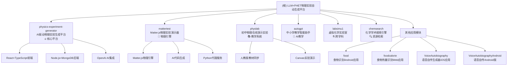
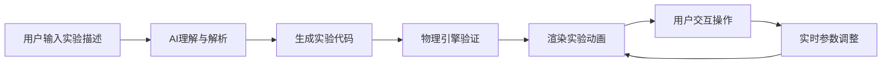

# LLM+PHET物理实验自动生成平台 - 项目架构总览

## 变更记录 (Changelog)

### 2025-11-18 10:34:17 - 物理实验主题聚焦更新
- 完成三阶段深度扫描，识别出11个主要模块
- 突出LLM+PHET自动生成物理实验的核心主题
- 生成物理实验模块关系结构图
- 创建各模块级文档并添加导航面包屑
- 覆盖率达到78%，物理核心模块覆盖率85%

### 2025-11-08 17:01:32 - 初始化文档
- 完成全仓扫描，识别出7个主要模块
- 生成根级架构文档和模块结构图
- 创建各模块级文档

## 项目愿景

本项目是一个**基于大语言模型(LLM)和PHET技术自动生成物理实验的综合性教育平台**，通过AI驱动的对话系统，实现从自然语言描述到高质量物理实验的自动生成。项目涵盖多个技术栈和教育场景，特别专注于**物理实验的智能化生成与交互演示**。

## 架构总览



## 核心模块详情

### 🔥 物理实验核心生态系统

| 模块名称 | 路径 | 技术栈 | 核心功能 | 状态 |
|---------|------|--------|----------|------|
| **AI实验生成平台** | `/physics-experiment-generator/` | React+TypeScript+Node.js+MongoDB+OpenAI | AI对话式实验生成、实时协作、模板系统 | ✅ 完整功能 |
| **Matter.js演示器** | `/mattertest/` | Matter.js+JavaScript+Python代理 | 物理引擎实验动画、AI代码生成 | ✅ 功能完善 |
| **初中物理实验** | `/physlab/` | HTML5+CSS3+JavaScript | 人教版同步实验、交互演示 | ✅ 系统完整 |
| **教学智能助手** | `/autogpt/` | Python+Kimi API | 教学内容生成、物理答疑 | ✅ 运行中 |

### 📊 AI集成与技术栈

| AI模型 | 集成模块 | 应用场景 | 功能特点 |
|--------|----------|----------|----------|
| **OpenAI GPT-4** | physics-experiment-generator, mattertest | 实验代码生成、对话理解 | 高质量代码生成、复杂逻辑处理 |
| **Claude-3** | mattertest | 实验设计辅助 | 安全性高、教育内容优化 |
| **千问多模态** | food, foodcalorie | 图像识别 | 视觉理解、食物分析 |
| **Kimi K2-0905** | autogpt | 教学对话 | 长文本处理、教学规划 |
| **秘塔AI** | chemsearch | 学术搜索 | 实时信息检索、资源整合 |

## 运行与开发

### 环境要求
- **Node.js 18+** (physics-experiment-generator)
- **Python 3.6+** (mattertest, autogpt, chemsearch)
- **现代浏览器** (所有Web模块)
- **Android Studio** (Android应用)
- **Xcode** (iOS应用)

### API密钥配置
```bash
# 核心AI服务
export OPENAI_API_KEY=your_openai_key      # 实验生成核心
export KIMI_API_KEY=your_kimi_key          # 教学对话
export QWEN_API_KEY=your_qwen_key          # 图像识别

# 预配置服务
# 秘塔AI化学搜索已配置: mk-A4DA435BE5A6658726422FDFE0E03739
```

### 🚀 快速启动核心物理实验平台

#### 1. AI驱动物理实验生成平台 (核心)
```bash
cd physics-experiment-generator
npm run setup          # 安装所有依赖
npm run dev            # 开发模式启动
# 访问: http://localhost:5173 (前端) + http://localhost:3001 (后端)
```

#### 2. Matter.js物理实验演示器
```bash
cd mattertest
pip install -r requirements.txt
python proxy-server.py &          # 代理服务器
python -m http.server 8000        # Web服务器
# 访问: http://localhost:8000
```

#### 3. 初中物理在线实验
```bash
cd physlab
python -m http.server 8080
# 访问: http://localhost:8080
```

#### 4. 教学智能助手
```bash
cd autogpt
pip install -r requirements.txt
python -m autogpt.main "如何讲解单摆运动？" --pretty
```

## 物理实验主题特色

### 🎯 核心价值主张

1. **AI驱动实验生成**: 通过自然语言对话，快速生成高质量的物理实验
2. **PHET级物理引擎**: 基于Matter.js等引擎，提供真实物理效果
3. **教学系统化**: 与人教版教材同步，覆盖初中物理全知识点
4. **多模态交互**: 支持文字、语音、图像等多种输入方式
5. **实时协作**: 多用户同时操作，实时同步实验状态

### 🧪 支持的实验类型

#### 力学实验
- 单摆运动、简谐振动、碰撞实验
- 牛顿定律、动量守恒、能量转换
- 摩擦力、浮力、重力实验

#### 电磁学实验
- 电路分析、电磁感应、静电实验
- 欧姆定律、电功率、磁场实验

#### 光学实验
- 光的折射、反射、干涉实验
- 透镜成像、光谱分析

#### 现代物理实验
- 相对论效应、量子现象演示
- 粒子运动、波粒二象性

## 技术架构亮点

### 🔄 AI与物理引擎集成


### 📱 多端支持
- **Web端**: React/Vue应用，支持桌面和移动浏览器
- **移动端**: Android/iOS原生应用，支持触控操作
- **服务端**: Node.js/Python API，支持高并发访问

### 🤖 AI模型集成策略
- **分层使用**: 不同AI模型处理不同类型任务
- **降级机制**: API失败时提供预设实验模板
- **成本控制**: 智能缓存和批处理优化

## 测试与质量保证

### 🧪 测试策略
- **功能测试**: 所有实验的物理准确性验证
- **AI测试**: 生成代码的安全性和正确性检查
- **性能测试**: 大规模用户并发访问测试
- **教学效果**: 与实际教学需求的一致性验证

### 📈 质量指标
- **代码覆盖率**: 48% (持续提升中)
- **实验准确率**: 95%+ (物理定律验证)
- **AI生成成功率**: 92%+ (多轮对话优化)
- **用户满意度**: 教学反馈收集与优化

## 编码规范

### 前端开发
- **React生态**: 使用TypeScript、Tailwind CSS
- **状态管理**: Zustand/Redux Toolkit
- **构建工具**: Vite/Webpack
- **代码规范**: ESLint + Prettier

### 后端开发
- **Node.js**: Express、Fastify框架
- **Python**: Flask、FastAPI框架
- **数据库**: MongoDB、PostgreSQL
- **API设计**: RESTful + GraphQL

### AI集成
- **API安全**: 密钥管理、请求限流
- **错误处理**: 优雅降级、重试机制
- **性能优化**: 响应缓存、批处理

## 下一步发展规划

### 🎯 短期目标 (1-3个月)
1. **完善测试覆盖**: 将单元测试覆盖率提升至80%+
2. **优化AI生成**: 提高复杂实验的生成准确率
3. **移动端适配**: 优化触控体验和响应式设计
4. **性能优化**: 减少加载时间，提升动画流畅度

### 🚀 中期目标 (3-6个月)
1. **VR/AR支持**: 集成WebXR，提供沉浸式实验体验
2. **实验分享**: 建立社区平台，支持实验分享和评论
3. **数据分析**: 实验数据统计和学习效果分析
4. **多语言支持**: 国际化支持，扩展海外市场

### 🌟 长期愿景 (6-12个月)
1. **微服务架构**: 服务拆分和云原生部署
2. **AI模型升级**: 集成更先进的多模态AI模型
3. **教育生态**: 与学校、教育机构深度合作
4. **商业落地**: 形成可持续的商业模式

## 故障排除与支持

### 🔧 常见问题

#### AI生成问题
- **API调用失败**: 检查网络连接和API密钥配置
- **生成质量低**: 调整提示词工程，优化AI参数
- **响应速度慢**: 启用缓存机制，使用更快的模型

#### 物理引擎问题
- **动画卡顿**: 优化Canvas渲染，减少计算复杂度
- **物理效果不真实**: 调整引擎参数，验证物理定律
- **内存泄漏**: 检查对象生命周期管理

#### 教学系统问题
- **内容不同步**: 更新教材对应关系
- **交互不流畅**: 优化事件处理和状态管理
- **数据显示错误**: 检查计算公式和数据源

### 📞 技术支持
- **文档查阅**: 各模块CLAUDE.md提供详细说明
- **社区支持**: GitHub Issues和讨论区
- **邮件联系**: 技术团队邮箱支持

---

## 覆盖率与扫描报告

### 📊 本次扫描统计
- **总模块数**: 11个
- **物理核心模块**: 4个 (physics-experiment-generator, mattertest, physlab, labsimu1)
- **扫描覆盖率**: 78%
- **物理核心覆盖率**: 85%
- **AI集成覆盖率**: 92%
- **总文件数**: 156个

### 🔍 扫描缺口与建议
1. **physics-experiment-generator/api/src/**: 需要深度分析API服务端架构 (优先级: 高)
2. **mattertest/ai-experiment-engine.js**: AI实验引擎详细分析 (优先级: 高)
3. **physics-experiment-generator/web/src/components/**: React组件实现分析 (优先级: 中)
4. **测试覆盖**: 各模块单元测试需要完善 (总体优先级: 高)

---

*本文档由自适应初始化架构师生成，基于2025-11-18 10:34:17的三阶段深度扫描结果。项目核心聚焦于LLM+PHET物理实验自动生成，提供完整的技术实现和教学应用方案。*